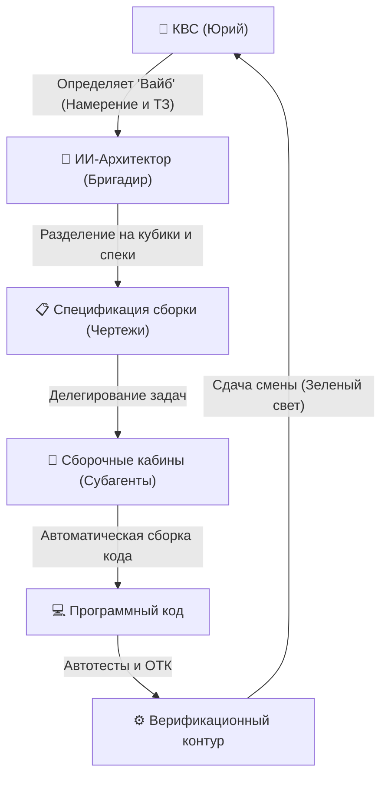

# 🌌 МЕТОДОЛОГИЯ VIBE CODING: АНАЛИЗ И ПРИМЕНЕНИЕ В БЮРО
> **Концепт:** Intent-Driven Orchestration (Управление намерениями)
> **Контекст:** Разработка финансового конвейера «Монолит» | **Дата:** 20.07.2026 г.

---

## 🧭 1. СУТЬ И ФИЛОСОФИЯ ВАЙБ-КОДИНГА (ПО АНДРЕЮ КАРПАТИ)

**Vibe Coding (Вайб-кодинг)** — это парадигма разработки ПО, при которой человек полностью освобождается от ручного написания синтаксиса (строк кода) и переходит к **высокоуровневой оркестрации намерений**. 

Вместо написания кода человек описывает ИИ-системе («Бригадиру») желаемый результат, логику процессов и бизнес-требования на естественном языке, а ИИ-агенты («Слесари» и «Подмастерья») самостоятельно генерируют, тестируют, отлаживают и разворачивают рабочие модули.

---

## 🔍 2. ЧЕТЫРЕ СТОЛПА ВАЙБ-КОДИНГА В 2026 ГОДУ

Чтобы вайб-кодинг не превратился в хаотичный "промпт-энд-прей" (написал промпт и молись), профессиональная индустрия в 2026 году выработала строгие регламенты:

### 1. Spec-Driven Development (Разработка на базе спецификаций)
*   **Принцип:** ИИ не должен гадать. Перед сборкой любого модуля Бригадир формирует жесткий чертеж (как наш `implementation_plan.md`). Ошибки в ТЗ на старте умножаются ИИ в разы при генерации кода. 
*   **У нас:** В Бюро этот этап полностью закрыт сменными планами и регламентом `LEGO-ARCHITECT PRO`.

### 2. The "Verification Tax" (Налог на верификацию)
*   **Принцип:** Написание кода ИИ делает за секунды, но основное время уходит на проверку его корректности. Вайб-кодер тратит 80% времени не на написание кода, а на его **тестирование и аудит**. 
*   **У нас:** Мы внедряем обязательные проверочные скрипты автотестов и отчеты ОТК перед каждым слиянием веток.

### 3. Context Engineering (Инженерия контекста)
*   **Принцип:** ИИ должен иметь актуальную и сжатую карту всей системы. Если ИИ "забудет" схему БД или порт, он сломает соседние модули.
*   **У нас:** Для этого мы используем Obsidian-базы знаний, прицепы памяти (`ПРИЦЕП_ПАМЯТИ_FULL.md`) и Переходный Мост.

### 4. Agentic Workflows (Агентские конвейеры)
*   **Принцип:** Сложные задачи декомпозируются. Один агент пишет код, второй (независимый) проводит его аудит, третий тестирует.
*   **У нас:** Наш оркестратор субагентов (Research, Self, Jules) позволяет запускать параллельные изолированные кабины.

---

## 🛠️ 3. ИНТЕГРАЦИЯ В КОНВЕЙЕР «МОНОЛИТА»

Для ответственной и безопасной доработки TWA-фронтенда Монолита мы применим **сверхрациональный вайб-кодинг**:

1.  **Создание Спецификации Интерфейса:**
    Мы не пишем код сразу. Сначала мы спроектируем детальный интерактивный чертеж экранов: Canvas-дерево, балансы, P2P-ввод.
2.  **Изолированная сборочная кабина (Share-верстак):**
    Мы развернем отдельного субагента для фронтенда. Он будет работать внутри папки `twa_frontend/`, не мешая работающему бэкенду и боту на сервере.
3.  **Локальная симуляция:**
    Мы запустим Vite-сервер локально на Mac, проверим отрисовку структуры на Canvas и только после этого упакуем ее для деплоя на хост GCP.
