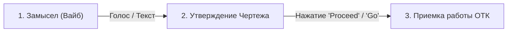

# 📑 ПАМЯТКА КВС: КАК УПРАВЛЯТЬ ФАБРИКОЙ ПО МЕТОДУ ВАЙБ-КОДИНГА

> **Карманный справочник Генерального Конструктора (Юрия)** | Версия 1.0

---

## 🎯 ТРИ ПРОСТЫХ ШАГА ДЛЯ КВС:

### 1️⃣ Шаг 1: Задаешь Вайб и Образ (Без IT-сленга)
- Говоришь или пишешь свою идею на понятном человеческом языке: *«Хочу, чтобы Гагарин на сервере научился отвечать через локальную Gemma 2 (9B), но с откатным вентилем на Gemini API»*.
- **Не думаешь про код, переменные и файлы.**

### 2️⃣ Шаг 2: Получаешь и Утверждаешь Чертеж (`implementation_plan.md`)
- ИИ-Архитектор переводит твой образ в строгий Чертеж Сборки, разбивает на лего-кубики и показывает тебе на правом экране Electron.
- Ты просматриваешь чертеж и нажимаешь **Proceed** («Go / Подтверждаю»).

### 3️⃣ Шаг 3: Принимаешь готовую работу под ключ
- ИИ-Архитектор и субагенты сами собирают кубики, запускают проверочный стенд ОТК (авто-тесты) и отчитываются на приборной панели.
- Ты получаешь работающее решение без мусора и суеты!

---

## 💡 ЗОЛОТЫЕ ПРАВИЛА КВС:
1. **Никакой рутины:** Все файлы, терминалы и логи ведут роботы.
2. **Никакого IT-сленга:** Требуй перевода любых технических слов в Лего-Кубики, Вентили, Замки и Чертежи.
3. **ОТК на прочность:** Требуй физической проверки работоспособности перед фиксацией результата.

---

[🏢 АВТОНОМНОЕ БЮРО](file:///Users/tur/.gemini/antigravity/brain/b862c857-5a4a-4341-bc0f-6a11badc79b1/АВТОНОМНОЕ_БЮРО_ПРОЕКТИРОВАНИЯ.md) | [📟 ПУЛЬТ УПРАВЛЕНИЯ](file:///Users/tur/.gemini/antigravity/brain/b862c857-5a4a-4341-bc0f-6a11badc79b1/autonomous_bureau_dashboard.md) | [💬 ДИАЛОГ](file:///Users/tur/.gemini/antigravity/brain/b862c857-5a4a-4341-bc0f-6a11badc79b1/РАБОЧИЙ_ДИАЛОГ.md) | [📅 ПОВЕСТКА ПЛАНЕРКИ](file:///Users/tur/.gemini/antigravity/brain/b862c857-5a4a-4341-bc0f-6a11badc79b1/ПОВЕСТКА_ПЛАНЕРКИ.md)
