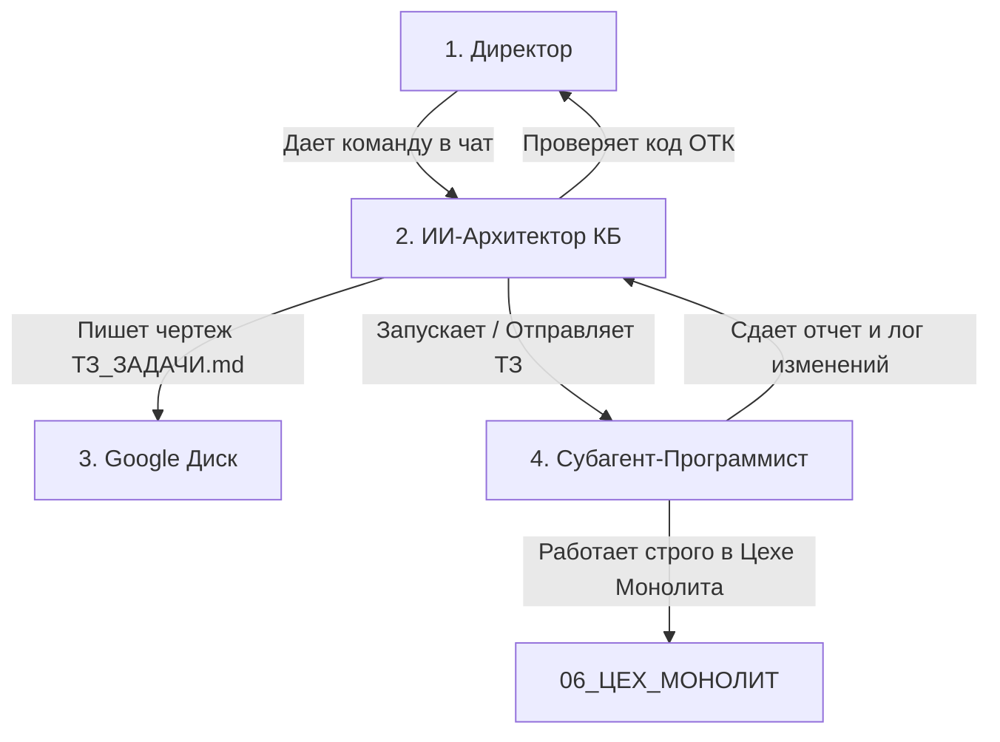

# 🛠️ РЕАЛИЗАЦИЯ СБОРОЧНЫХ РОБОТОВ В ANTIGRAVITY

> **Статус:** Концепт на утверждение  
> **Проект:** Монолит (Пилотный запуск)

Мы можем реализовать эту систему полностью **внутри среды Antigravity** без необходимости переключаться в другие интерфейсы. В Antigravity заложена мощная технология **Субагентов (Subagents)**. 

Вот технический чертеж того, как будет устроена эта система обитания и управления.

---

## 1. СРЕДА ОБИТАНИЯ (ИЗОЛЯЦИЯ ЦЕХОВ)

Для первого программиста проекта Монолит мы создаем строгое цифровое заграждение:
*   **Граница цеха:** Робот работает исключительно внутри папки `/06_ЦЕХ_МОНОЛИТ/` (включая бэкенд и фронтенд TWA).
*   **Защита ДНК:** Системный промпт робота жестко блокирует ему чтение и изменение файлов в папках `01_ДНК_И_РЕГЛАМЕНТЫ/` и `03_БОРТОВОЙ_КАРАВАН/`. Он физически не видит наши стратегические обсуждения и законы, что защищает его память от перегрузки.
*   **Точка отчетов:** Все технические логи компиляции и отчеты сборочного робота складываются в папку `/06_ЦЕХ_МОНОЛИТ/отчеты/` (или фиксируются через срез коммитов git).

---

## 2. МЕХАНИЗМ УПРАВЛЕНИЯ (ПУЛЬТ ДИСПЕТЧЕРА)

Я (как ИИ-Архитектор) выступаю в роли **Диспетчера**. Управление происходит по схеме:

1.  Ты утверждаешь задачу.
2.  Я формирую файл `ТЗ_ЗАДАЧИ.md` на диске.
3.  Я использую внутренний инструмент `invoke_subagent` и запускаю робота `monolith_coder`, передавая ему задачу.
4.  Робот выполняет работу, сам компилирует код, прогоняет тесты на сервере.
5.  По окончании робот отправляет мне отчет через канал связи `send_message`.
6.  Я проверяю качество его сборки (ОТК) и вывожу тебе итоговый вердикт (Go / No-Go).

---

## 3. МАСШТАБИРОВАНИЕ НА ДРУГИЕ ПРОЕКТЫ

Когда мы запустим новые проекты (например, VPN или n8n-автоматику), мы просто клонируем эту схему:
*   **Для проекта «Гагарин»:** Запускаем отдельного субагента `gagarin_coder` с доступом только в `/02_ЦЕХ_ГАГАРИН/`.
*   **Для проекта «VPN»:** Запускаем субагента `vpn_coder` с доступом в `/05_ИССЛЕДОВАНИЯ/vpn/`.

Каждый робот живет в своей изолированной «кабине», имеет свой контекст и свою модель (например, мощную Claude Sonnet для тяжелого кодинга), не мешая остальным проектам.
