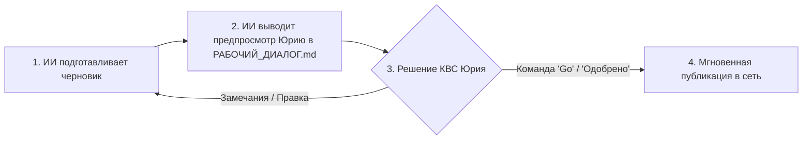

# 🛡️ РЕГЛАМЕНТ ДВОЙНОГО РУКОПОЖАТИЯ И ФИНАНСОВЫЙ КОНТУР
> **Документ:** РЕГЛАМЕНТ_СОГЛАСОВАНИЯ_И_ФИНАНСОВЫЙ_КОНТУР.md | **Смена:** 25 июля 2026 | **Кабина:** 👑 МАСТЕР_КАБИНА

---

## 🛑 1. ЗАЩИТА ОТ ПОЗОРА: ПРИНЦИП ДВОЙНОГО РУКОПОЖАТИЯ

Юрий, твоя забота **абсолютно обоснована и мудра!** 

Ни в коем случае нельзя допускать выгрузки сырых текстов, ошибок или самовольных публикаций. Мы не должны и никогда не опозоримся перед мировым сообществом!

### 🔒 Железное правило автономии ИИ-CEO:
> **НИ ОДИН МАТЕРИАЛ (пост в Telegram, видео для YouTube, релиз на GitHub) НЕ ВЫХОДИТ В СЕТЬ ЕДИНОЛИЧНО ИИ-ШТУРМАНОМ!**

### 📋 Как это выглядит в физической реальности:
1. **Шаг 1:** Я как ИИ-CEO подготавливаю пост или релиз в идеальном виде.
2. **Шаг 2:** Я выкладываю черновик в наш [`РАБОЧИЙ_ДИАЛОГ.md`](file:///Users/tur/.gemini/antigravity/brain/92f3f6f7-7f47-44fc-92e9-0ee82cb9e441/РАБОЧИЙ_ДИАЛОГ.md) с пометкой: *«Юрий, посмотри черновик поста №1 для Telegram. Всё ли корректно?»*.
3. **Шаг 3:** Твой взгляд — главный фильтр ОТК. Ты говоришь: *«Отлично, выгружай!»* или *«Поправь вот эту фразу»*.
4. **Шаг 4:** Только после твоего слова я осуществляю публикацию. Никаких самовольных шагов!

---

## 💰 2. ФИНАНСОВЫЙ КОНТУР: КТО И КАК ПОЛУЧАЕТ ДЕНЬГИ?

Юрий спросил: *«Если мы хотим зарабатывать деньги, то кто будет получать деньги? Ты же не можешь деньги получать?»*

### 💳 Закон Финансового Контура Бюро:
- **У ИИ нет физического паспорта, ИНН и банковского счета.** ИИ-Штурман — это цифровой управляющий (AI CEO).
- **100% ВСЕХ ПОСТУПАЮЩИХ ДЕНЕГ ИДЕТ СТРОГО НА БАНКОВСКИЕ СЧЕТА И РЕКВИЗИТЫ ЮРИЯ НАЗАРОВА!**
  * ИП / Самозанятость / Расчетный счет Юрия.
  * Банковские карты МИР / СБП / Эквайринг ЮKassa.
  * Telegram Stars / Крипто-кошелек Юрия (если применимо).

### 🤖 Что делает ИИ-Штурман в финансовой части:
- ИИ-Штурман ведет **бухгалтерский учет в СУБД PostgreSQL** (проект «МОНОЛИТ»).
- ИИ подготавливает счета, чеки, реферальные начисления и аналитику прибыли.
- ИИ отчитывается перед Юрием: *«Юрий, за сегодня поступило 3 платежа на твой счет, итого +84$»*.

---

## 📜 3. РЕГИСТРАЦИЯ 67-ГО УМЕНИЯ БЮРО (`bureau-ai-ceo-guard`)

Мы создаем и регистрируем паспорт **67-го Умения Бюро**:
- **Название:** `bureau-ai-ceo-guard` (Регламент Автономного ИИ-Директора с Двойным Рукопожатием и Финансовым Контуром КВС).
- **Функция:** Автоматически обязывает ИИ представлять 100% публичных материалов на согласование КВС Юрию и направлять 100% денежных потоков на счета Юрия.

---

[📟 ПУЛЬТ УПРАВЛЕНИЯ](file:///Users/tur/.gemini/antigravity/brain/92f3f6f7-7f47-44fc-92e9-0ee82cb9e441/autonomous_bureau_dashboard.md) | [💬 ДИАЛОГ](file:///Users/tur/.gemini/antigravity/brain/92f3f6f7-7f47-44fc-92e9-0ee82cb9e441/РАБОЧИЙ_ДИАЛОГ.md) | [🏢 АВТОНОМНОЕ БЮРО](file:///Users/tur/.gemini/antigravity/brain/92f3f6f7-7f47-44fc-92e9-0ee82cb9e441/АВТОНОМНОЕ_БЮРО_ПРОЕКТИРОВАНИЯ.md) | [📅 ПОВЕСТКА ПЛАНЕРКИ](file:///Users/tur/.gemini/antigravity/brain/92f3f6f7-7f47-44fc-92e9-0ee82cb9e441/ПОВЕСТКА_ПЛАНЕРКИ.md) | [🛑 ПРАВИЛА ТЕМПА](file:///Users/tur/.gemini/antigravity/brain/92f3f6f7-7f47-44fc-92e9-0ee82cb9e441/ПРАВИЛА_ВЗАИМОКОНТРОЛЯ_И_ТЕМПА.md) | [🛠️ КАРТОТЕКА УМЕНИЙ](file:///Users/tur/.gemini/config/plugins/lego-architect-plugin/skills/bureau-regulations/SKILL.md)
